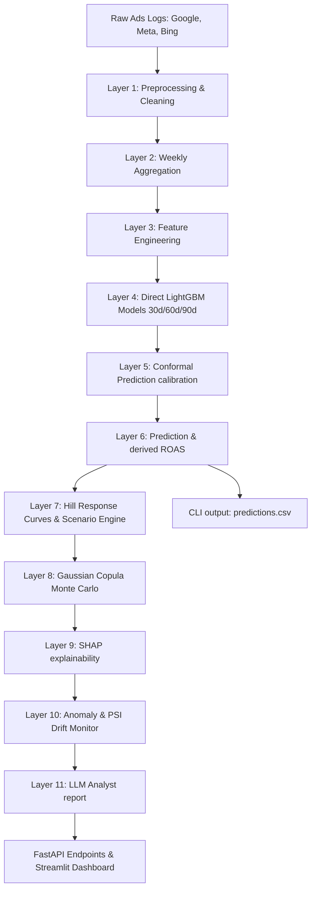

# Probabilistic Marketing Intelligence Engine (PMIE)

PMIE is a production-grade, end-to-end forecasting and budget scenario planning utility designed for ecommerce marketing agencies. It ingests campaign performance logs from Google Ads, Meta Ads, and Bing Ads, trains direct-horizon forecasting models, applies split-conformal bounds, runs joint empirical Monte Carlo simulations, fits Hill response curves for extrapolation, detects anomalies, monitors data drift via PSI, and leverages a template-based LLM analyst to write executive memos.

---

## Architecture Flow



---

## Installation & Setup

### Prerequisites

- Python 3.11 or newer
- Git
- Bash for `run.sh` on Linux/macOS/Git Bash, or PowerShell/CMD using the Python commands shown below

The repository includes sample CSV input files under `data/`. Generated files such as `pickle/model.pkl` and `output/predictions.csv` are intentionally not committed; recreate them locally with the training commands below.

1. **Clone the repository and enter the project**:
   ```bash
   git clone <your-repo-url>
   cd NetElixirHackathon
   ```

2. **Create and activate a virtual environment**:
   ```bash
   python -m venv venv
   # On Windows (PowerShell):
   .\venv\Scripts\Activate.ps1
   # On Windows (Git Bash / Bash):
   source venv/Scripts/activate
   # On Linux/macOS:
   source venv/bin/activate
   ```

3. **Install pinned dependencies**:
   ```bash
   python -m pip install --upgrade pip
   pip install -r requirements.txt
   ```

4. **Configure optional environment variables**:
   ```bash
   # Linux/macOS/Git Bash:
   cp .env.example .env
   # Windows PowerShell:
   Copy-Item .env.example .env
   ```
   `GEMINI_API_KEY` is optional. Without it, PMIE runs with the deterministic fallback analyst logic.

5. **Train the local model artifacts**:
   ```bash
   python src/train_revenue.py
   python src/conformal.py
   python src/train_roas.py
   ```
   These commands create `pickle/model.pkl`, which is required by the CLI, API, and dashboard.

6. **Verify the installation by running unit tests**:
   ```bash
   python -m unittest discover -s tests
   ```

---

## How to Run the App

### 1. Command Line Interface (CLI)
PMIE supports batch predictions via `run.sh` for integration with automated pipelines. Train the model first so `pickle/model.pkl` exists.
```bash
./run.sh <DATA_DIR> <MODEL_PATH> <OUTPUT_PATH>
```
* **Defaults**:
  - `DATA_DIR`: `./data`
  - `MODEL_PATH`: `./pickle/model.pkl`
  - `OUTPUT_PATH`: `./output/predictions.csv`
* **Execution**:
  ```bash
  # Execute with defaults
  ./run.sh
  ```
* **Cross-platform Python equivalent**:
  ```bash
  python src/predict_cli.py ./data ./pickle/model.pkl ./output/predictions.csv
  ```

### 2. FastAPI Backend
Exposes interactive Swagger endpoints for scenario simulations, explanations, and uploads.
```bash
# Start FastAPI server
python src/api.py
```
* Access Swagger UI: [http://127.0.0.1:8000/docs](http://127.0.0.1:8000/docs)
* **Endpoints**:
  - `POST /upload`: Upload Ads datasets.
  - `GET /forecast`: Retrieve baseline reconciled forecasts.
  - `POST /simulate`: Simulate budget shifts (+20%, -10%, etc.).
  - `GET /explain`: Get SHAP drivers.
  - `GET /anomalies`: Get data drift PSI and anomalies.

### 3. Streamlit Dashboard Frontend
Launches the interactive GUI containing Forecast Dashboard, Scenario Builder, Response Curves, and Data Ingestion pages.
```bash
# Start dashboard
streamlit run frontend/dashboard.py
```
* Access Dashboard: [http://localhost:8501](http://localhost:8501)

---

## Underlying Business Logic & Modeling

1. **Layer 1: Preprocessing & Data Validation**
   - **Google Ads**: Converts micro-cost to spend. Excludes Google Display campaigns from modeling but retains them for aggregate reporting.
   - **Meta Ads**: Renames `conversion` to `revenue` and estimates count proxy based on AOV constraints. Fills missing budgets using campaign-level medians.
   - **Bing Ads**: Filters for Search campaigns for revenue modeling. Excludes non-Search campaigns from modeling but keeps them for reporting.
   - **CPC Winsorization**: Calculates CPC = `spend / clicks` and caps (winsorizes) it at the 99th percentile across all records.

2. **Layer 2: Weekly Aggregation & Reconciliations**
   - Regroups daily records into weekly records starting on Monday.
   - Computes forecasts at the Campaign level first, and aggregates results upward to Campaign Type, Channel, and Total Portfolio levels (bottom-up summation), ensuring exact mathematical reconciliation.
   - Calculates ROAS as $Revenue / Spend$, preventing arithmetic contradictions.

3. **Layer 3: Feature Engineering**
   - Extract lag variables: `lag_1`, `lag_2`, `lag_4`, `lag_8`.
   - Extract rolling averages: `rolling_4w`, `rolling_8w`, `rolling_12w` (means).
   - Seasonality: `week_of_year`, `month`, `quarter`.
   - Handles categoricals natively in LightGBM.

4. **Layer 4: Direct Horizon ML Models**
   - Trains three separate LightGBM models to predict cumulative future revenue directly over 30d, 60d, and 90d horizons, avoiding recursive error accumulation.
   - Splits data chronologically using `TimeSeriesSplit` cross-validation.

5. **Layer 5: Conformal Prediction**
   - Uses split-conformal prediction intervals. Calibration is run on a holdout time-series partition to find the 80% relative error quantile per horizon.
   - Bounds are mapped to predictions as P10, P50 (expected), and P90, satisfying $P10 \le P50 \le P90$.

6. **Layer 6: Response Curves & Scenario Engine**
   - Within historical ranges, observed data dominates predictions.
   - Outside historical maximums, a fitted three-parameter Hill function extrapolates the spend-revenue relationship.
   - Extrapolations are calculated for Search, Shopping, and PMax campaign types.

7. **Layer 7: Correlated Monte Carlo Simulation**
   - Runs 10,000 iterations for CTR, CVR, and AOV, drawing joint samples from empirical distributions using a Gaussian Copula to preserve historical correlations.
   - Projects simulated revenue distributions without using CPC.

8. **Layer 8: SHAP Explainability**
   - Uses `shap.TreeExplainer` on LightGBM models to extract feature contributions.
   - Groups top 5 contributors into Spend Drivers, Efficiency Drivers, and Seasonality Drivers.

9. **Layer 9: Diagnostics & Data Drift Monitoring**
   - Detects anomalies in the last 90 days where actual revenue falls outside the conformal interval limits.
   - Calculates the Population Stability Index (PSI) to detect data drift in Spend, CTR, CVR, and ROAS.
   - High drift (PSI > 0.25) raises warning alerts.

10. **Layer 10: LLM Analyst Executive Memo**
    - Parses all model results, drift diagnostics, anomalies, and Monte Carlo statistics.
    - Compiles a complete, structured JSON report containing a summary memo, opportunity lists, and a mitigation risk radar.
